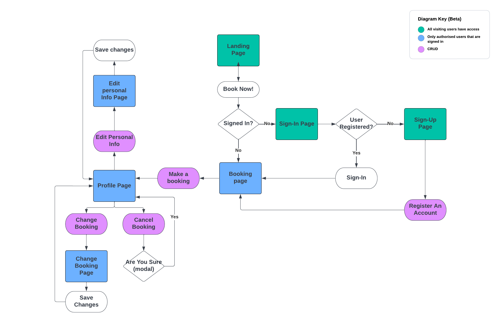

# Motivate Fitness
This is an appoinment booking application for an online personal training service.

You can visit the live site [here]()

## Contents
- [User Experience](#user-experience)
    - [User Stories](#user-stories)
    - [Agile Methodology](#agile-methodology)
    - [Wireframes](#wireframes)
    - [Database](#database)
    - [Design](#design)
- [Features](#features)
    - [Existing Features](#existing-features) 
    - [Future Features](#future-features)
- [Technologies](#technologies)
    - [Languages and Frameworks](#languages-and-frameworks)
    - [Technologies Used](#technologies-used)
    - [Libraries](#libraries)
- [Testing](#testing)
    - [Automated Testing](#automated-testing)
    - [Validator Testing](#validator-testing)
    - [Lighthouse Testing](#lighthouse-testing)
    - [Browser Testing](#browser-testing)
    - [User Stories Testing](#user-stories-testing)
    - [Manual Testing](#manual-testing)
- [Bugs](#bugs)
    - [Fixed](#fixed-bugs)
    - [Unfixed](#unfixed-bugs)
- [Deployment](#deployment)
- [Credits](#credits)
- [Acknowledgements](#acknowledgements)

## **User Experience**
### **User Stories**
#### **Site User**
[Back to top](#contents)
### **Agile Methodology**
#### **GitHub Project Board**

[Back to top](#contents)

### **Wireframes**
Wireframes were created using Balsamiq.

See [Wireframes.](static/readme/pt-booking-app.pdf)

[Back to top](#contents)

### **Database**
[Lucid chart](https://www.lucidchart.com/pages/) was used to make the entity relationship diagram showing my custom models and the user model which is built with Django AllAuth. Lucid chart was also used to make the flow chart mapping out the user journey throuh the site. 

[Back to top](#contents)
### **Design**
#### **Typography**
* [Font awesome](https://fontawesome.com/)
* I used [figma](https://www.figma.com/file/RgYErSjELw326fP4MH6jt4kT/Nunito-Pairings/duplicate?node-id=1%3A198) to check what fonts pair well with Nunita and ended up going with Roboto.

#### **Images**
 
* Images were taken from 
    * [Pixabay](https://pixabay.com)
    * [Unsplash](https://unsplash.com)
    * [Pexels](https://www.pexels.com)

#### **Colour Scheme and Accessibility**
 The first step for creating the colour scheme was to uplaod the hero image to [colormind](http://colormind.io/image/) and generate a few different palettes and copy the hex values.

 The next step was to go to input these hex values into the contrast grid on [Eightshapes](https://contrast-grid.eightshapes.com/) to check the WCAG 2.0 minimum contrast scores which helped me to pick a background and foreground colour that meet the accessibility requirements for good UX.

 

 

 

[Back to top](#contents)
## **Features**
### **Existing Features**
#### **Navigation Bar**
* The navigation bar is featured on all pages of the site. 
* 
* 
* 

 

[Back to top](#contents)

#### **Landing page**
* The landing page features the hero image of ...
* There is also a text overlay on the hero image with a call to action "Book Now!" button, as well as a short description of what's on offer.
* There is also a text overlay featuring a 3 part motivational message in the imperative.

#### **Footer**
* The footer contains links to the business's social media profiles as well as contact and copyright information.
* 
* 

[Back to top](#contents)
#### **Login Page**
* The login page was built using Django AllAuth. 
* I imported the template and gave it some basic styling using bootstrap. I also extended my base template so the user stays on the page when logging in and changed the text.

[Back to top](#contents)
#### **Sign Up Page**
* The sign up page is also from the authentication module allauth. 
* I imported the template and gave it some basic styling using bootstrap. I also extended my base template so the user stays on the page when logging in.

[Back to top](#contents)
#### **Booking Page**
* The place booking page is only accessible when logged in. If you are not logged in you will get redirected to the login page instead.
* The form contains all the necessary fields for the trainer to prepare for the consultation.
* The datepicker is the standard HTML element for picking dates. 
* In the model, there is a function to validate that the booking can't be done on a date in the past. 
* In the form itself there is also a validation that disables dates that are closer than two days in the future. 
* There is also a limit that you can't book more than 60 days in advance

* For the timepicker I used a plugin called [jQuery Timepicker](https://timepicker.co/). 

[Back to top](#contents)

#### **User Profile**
* A page where the user can view their upcoming appointments with the trainer.
* This is also the page where the user can change or cancel their appointments. 
* Bookings can only be canceledor changed more than 24 hours in advance of the appointment time.
* Once the booking is approved...
* The user profile also displays the user's personal information which can be edited using the edit button.

* When the user clicks "change" they are brought to a change appoinmtent form, which is the same as the booking form but with the user's appoinmtent details filled in.

* When a user tries to cancel a booking, an alert is shown and the user needs to confirm the cancellation.

[Back to top](#contents)

#### **Admin**
* The trainer you can view, edit and delete all bookings via the admin panel.
* They can  also add appointments in the case that an appointment is made over the phone or via social media messaging apps. 
* The trainer also has the ability to confirm a booking.

[Back to top](#contents)

### **Future Features**
* For now the client only wants a simple promotional site with a call to action in order to attract potential clients, but in the future as their online clientele grows, the site could feature a services/programmes section which could detail various packages, services and price points.
* An onsite payment system using stripe so that the trainer can take payments upfront for consultations, programmes and online one-to-one training sessions.
* A UI for the trainer which would allow them to manage bookings without having to go through the django admin panel.
* Email confirmation of confirmed appointments and for the registration process.
* A link to goodle calendar API to help users and admin keep track of appointments outside the app. 

[Back to top](#contents)
## **Technologies**
### **Languages and Frameworks** 
* [Django](https://www.djangoproject.com/) 
* [Bootstrap](https://getbootstrap.com/)
* [HTML5](https://en.wikipedia.org/wiki/HTML)
* [CSS3](https://en.wikipedia.org/wiki/CSS) 
* [JavaScript](https://en.wikipedia.org/wiki/JavaScript) 
* [Python](https://en.wikipedia.org/wiki/Python_(programming_language))

[Back to top](#contents)

### **Technologies Used** 
* [Gitpod](https://gitpod.io/)
* [Balsamiq](https://balsamiq.com/) 
* [Cloudinary](https://cloudinary.com/) 
* [Heroku](https://dashboard.heroku.com) 
* [ElephantSQL](https://www.elephantsql.com/)
* [PEP8 Validation](http://pep8online.com/)
* [HTML Validation](https://validator.w3.org/)
* [CSS Validation](https://jigsaw.w3.org/css-validator/) 
* [JSHint Validation](https://jshint.com/) 
* [Lucid chart](https://www.lucidchart.com/pages/)
* [Font awesome](https://fontawesome.com/)
* [Pairfonts](https://pairfonts.com/)
* [Google fonts](https://fonts.google.com/)
* [Balsamiq](https://balsamiq.com/wireframes/)
* [Github](https://github.com/)
* [Gitpod](https://gitpod.io/)
* [Tiny PNG](https://tinypng.com/)
* [Pixabay](https://pixabay.com)
* [Unsplash](https://unsplash.com)
* [Pexels](https://www.pexels.com)
* [Eightshapes](https://contrast-grid.eightshapes.com/)
* [rgbacolorpicker](https://rgbacolorpicker.com/hex-to-rgba)
* [Am I responsive](https://ui.dev/amiresponsive)

[Back to top](#contents)
### **Libraries**
The following libraries are used in the project and are located in the requirements.txt file.

[Back to top](#contents)
## **Testing**

### **Automated Testing**

[Back to top](#contents)

### **Validator Testing**

1. HTML
* HTML validation was done using [W3C Markup validator](https://validator.w3.org/)
* Some initial errors:
    * A....
        * This error is as a result of 
    * Another error showed ...

2. CSS
* CSS Validation was done using [Jigsaw](https://jigsaw.w3.org/css-validator/)

* No bugs were found in the CSS at the final tetsing stage as I had been testing throughout development and CSS bugs were common and obvious in the gitpod browser so were quickly identified and fixed.

3. Javascript
* Javascript validation was done using [JSHint Validator](https://jshint.com/).
* Upon testing there were not that many errors as I had been using JSHint throughout to check for and fix bugs. The initial results showed:
    * Warning: A...
    * One unused variable: selectedButton. I saw that I redeclared selectedButton inside whatever function it was in so there was no need to declare it at the top with a null value.
* Some common errors that came up throughout the project in JSHint were 
* I also used console log and the error messages that would display in the console in chrome devtools to resolve bugs along the way.   

#### JavaScript Validation

4. Python 

[PEP8 Online Validator](http://pep8online.com/)

[Back to top](#contents)
### **Lighthouse Testing**
 * Initial results showed 
    * I addressed this issue by 
* The ligthouse results for mobile showed 
* The final lighthouse results showed 

#### Lighthouse results

#### Lighthouse mobile results

#### Lighthouse final results

#### Lighthouse mobile final results

[Back to top](#contents)

### **Browser Testing**
The website is tested on the following browsers with no known issues:
- Mozilla Firefox
- Google Chrome (desktop and mobile version)
- Microsoft Edge
- Safari for iOS

[Back to top](#contents)
### **User Stories Testing**

[Back to top](#contents)

### **Manual Testing**

* All links are working.
* Clicking on the logo gets you back to the home page.
* If you try to access a page which requires the user to be logged in, you are redirected to the login page.
* An alert is shown everytime a user tries to delete something.
* A confirmation message is shown every time an action is performed.
* All CRUD (Create, Read, Update, Delete) functionality is working as it should.
* All forms have validation for the required fields.

[Back to top](#contents)

## **Bugs**

### **Fixed Bugs**
I have detailed some of the sources I used to fix bugs in the Credit section. Some of the main issues that were resolved were:
1. 

Source: [stack overflow](https://)
 

2. There were...
    * By ... 
    * Once I ... 

3. Another bug that occured was...
    * I ...

4. I had wanted to ..
    * I...

5. An error message displayed 
    * I ...
    * I ...
    * I...
    * Finally ...

    [Back to top](#contents)

### **Unfixed Bugs**
1. 

    * In the end, 
2. The code 

[Back to top](#contents)
## **Deployment**

### Steps to deploy:

#### **Gitpod**

1. Create a repository in github using the [Code Institute template](https://github.com/Code-Institute-Org/python-essentials-template). 
2. Click Use this Template and add a repository name.
3. Click Create Repository from template
4. While using this template ensure all inputs have \n to ensure deployment to heroku.
5. In terminal type pip3 freeze > requirements.txt press enter to update this file.
6. Add, commit and push all changes to github before starting steps to deploy to Heroku

#### **Heroku**
1. Log in to [Heroku](https://id.heroku.com).
2. From the dashboard, click the button labelled New in the top right corner and from the drop-down menu select Create New App.
3. Enter a name for the app and select your region.
4. Click Create App.                  
5. Find the Settings Tab and scroll down to Config Vars.
6. Click Reveal Config Vars and enter PORT into the Key box and 8000 into the Value box before clicking Add. 
7. Scroll down to the Buildpack section click Add Buildpack.
8. Select python and click Save Changes.
9. Next select node.js and Save Changes. 
10. Ensure python is the first buildpack listed and is above node.js.
11. Scroll to the top of the page and navigate to the Deploy tab.
12. Select Github as the deployment method.
14. Search for the repository name and click the connect button.
15. Scroll to the bottom of the deploy page and select Enable Automatic Deploys. 

[Back to top](#contents)

## **Credits**
I used the following resources to help me plan, build and fix bugs in my project.

*  : 
This video was useful to 

*  : 
This video was also useful to 

* :
This video helped me to research project ideas and 

* :
The approach in this video 

* :
This tutorial for setting up email with Django using Gmail.
### Websites:

### Articles:
The following article helped me create the dropdown menu for the gender option in the appoinments model.
* [Stack Overflow](https://stackoverflow.com/questions/31130706/dropdown-in-django-model)

* [w3schools](https://www.w3schools.com)

* 

* 

* 

* [Free Code Camp: How to Write Good Commit Messages: A Practical Git Guide](https://www.freecodecamp.org/news/writing-good-commit-messages-a-practical-guide/)

[Back to top](#contents)
## **Acknowledgements**
