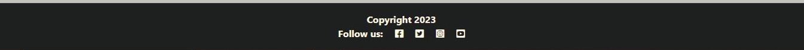

# Motivate Fitness
This is an appoinment booking application for an online personal training service.

You can visit the live site [here](https://pt-booking.herokuapp.com/)

## Contents
- [Planning and Project Conception ](#planning-and-project-conception)
    - [Project Goals](#project-goals)
    - [User Stories](#user-stories)
    - [Agile Methodology](#agile-methodology)
    - [Wireframes](#wireframes)
    - [Database](#database)
    - [Design](#design)
- [Features](#features)
    - [Existing Features](#existing-features) 
    - [Future Features](#future-features)
- [Technologies](#technologies)
    - [Languages and Frameworks](#languages-and-frameworks)
    - [Technologies Used](#technologies-used)
    - [Libraries](#libraries)
- [Testing](#testing)
    - [Manual Testing](/TESTING.md#manual-testing)
        - [Responsive Testing](/TESTING.md#responsive-testing)
        - [Lighthouse Testing](/TESTING.md#lighthouse-testing)
        - [Browser Testing](/TESTING.md#browser-testing)
        - [User Stories Testing](/TESTING.md#user-stories-testing)
        - [Features Testing](/TESTING.md#features-testing)
        
    - [Code Validation](/TESTING.md#code-validation)

- [Bugs](#bugs)
- [Deployment](#deployment)
- [Credits](#credits)
- [Acknowledgements](#acknowledgements)

## **Planning and Project Conception**
### **Project Goals**
The aim of this project was to build a basic booking system for a site owner who is a personal trainer and wants to build a personal brand to promote themselves, attract an online clientele, and to trial a personal site which allows people to book appointments with them easily.  
#
### **Agile Methodology**
#### **GitHub Project Board**

* This project was planned and carried out with the use of agile methodologies. 
* Epics, user stories, bugs and issues are recorded on the [Project Board](https://github.com/users/HPCarey/projects/4/views/1)

[Back to top](#contents)

### **User Stories**
* Epics, site user stories and admin user stories can be seen on the [project board](https://github.com/users/HPCarey/projects/4/views/1)

* User stories and Epics can also be viewed in the [issues](https://github.com/HPCarey/pt-booking/issues) for this repo. 

* For a comprehensive list of the user stories and details of how they were implemented, please consult the [TESTING.MD](/TESTING.md) file.

[Back to top](#contents)

### **Wireframes**
Wireframes were created using Balsamiq.

* Originally the wireframe plans a profile page where users could view and potentially edit their personal information.
* I wanted to focus more on the booking aspect of the site so the personal information aspect did not get implemented but will be noted as a future feature as the site concept is tested and developed with the site owner.

See [Wireframes.](static/readme/pt-booking-app.pdf)

[Back to top](#contents)

### **Database**
* [Lucid chart](https://www.lucidchart.com/pages/) was used to make the entity relationship diagram showing my custom model and the user model which is built with Django AllAuth. 
* Lucid chart was also used to make the flow chart mapping out the user journey throuh the site. 

[Back to top](#contents)

### **Design**

#### **Images**
 
* Hero Images were taken from pexels from 
    * The image source [Pexels](https://www.pexels.com/photo/man-working-out-2294361/)
    * The photographer [Li Sun](https://www.pexels.com/@823sl/)

#### **Colour Scheme and Accessibility**
 * First I uplaoded the hero image to [colormind](http://colormind.io/image/) to generate a few different palettes.

 * Input these hex values into the contrast grid on [Eightshapes](https://contrast-grid.eightshapes.com/) to check the WCAG 2.0 minimum contrast scores which helped me to pick a background and foreground colour that meet the accessibility requirements for good UX.

 

 

 

[Back to top](#contents)
## **Features**
### **Existing Features**
* For a comprehensive list of all site features, their function and UI design, please refer to the [User Stories Testing](/TESTING.md#user-stories-testing) section of the [TESTING.md](/TESTING.md) document. 
* Here I will refer to some features that were not featureed in the user story testing section or for which there is a UI/design aspect that might require explanation.
### **logo**
* Logo provided by site owner for his business.
* Used as the favicon for the webpage as well as the navbar logo home link.
* The logo is also featured on the custom 404 page.

### **navbar**
* The navbar is fully responsive and changes to reflect the user's logged-in or logged-out status.

* The navbar also reflects the current webpage that the user is visiting through highlighting the active navlink in a white colour.
* I wanted to feature a dropdown menu in the navabr to have the option of adding more features for returning users in  the future. 
* In the future, the nav dropdown could feature a personal profile containing client health and fitness information and goals, an appointments history and/or purchase history, and a programmes page featuring their personalised training programme from their trainer.

### **Landing page** 
* The landing page was the basis for the site design and colour scheme.
* The logo was the starting point and the site owner wanted a simple black and white "no frills" aestheitc.
* I like the idea of adding a kind of grey scale colour scheme to make the black and white feel a bit more high-end and sophoisticated.
* I searched for a hero image that communicated the brand well and that had a grey/black aesthetic to help me develop a colour pallette. 
* I used bootstrap styles for buttons and links but tried to target them with a more, grey, black and white colour scheme.
* The landing page is also important not only to communicate immediately to the user about the site and the product, but also as a call to action using the Book now! button and the offer of a free consultation to hook the user into interacting with the site content.

### **custom 404 page**
* The custom 404 page let's user's know they are still connected to the site but on a non-existent page.
* The navbar is extended from the base.html so users can easily navigate to the specific page they want.
* The logo on this page also acts as a home navlink so users can easily find their way back.

[Back to top](#contents)

### **footer**
* For the moment the footer only features generic social media links but could potentially feature the site owner's business profile links.

### **Future Features**
* For now the client only wants a simple promotional site with a call to action in order to attract potential clients, but in the future, the site could feature a services/programmes section which could detail various packages, services and price points for clients.
* A personal information section in the profile that clients can update and edit in order to communicate there needs and changing circumstances with trainers. 
* An onsite payment system using stripe so that the trainer can take payments upfront for consultations, programmes and online one-to-one training sessions.
* A UI for the trainer which would allow them to manage bookings without having to go through the django admin panel.
* Email confirmation of confirmed appointments and for the registration process.
* A goodle calendar API to help users and admin keep track of appointments outside the app.
* Social accounts login for google and other email accounts so that users don't necessarily have to create a new username and password to sign up.
* I would like to improve on the booking system too. If I can find out how the trainer likes to manage their schedule it will be easier to apply more rules to the booking actions, like preventing bookings/cancellations within 24 or 48 hours. 
* Implementing ajax for a more user friendly UI for booking. 

[Back to top](#contents)
## **Technologies**
### **Languages and Frameworks** 
* [Django](https://www.djangoproject.com/) 
    * [crsipy forms](https://django-crispy-forms.readthedocs.io/en/latest/)
    * [AllAuth](https://django-allauth.readthedocs.io/en/latest/)
    * [dj_database_url](https://pypi.org/project/dj-database-url/)
    * [psycopg2](https://pypi.org/project/psycopg2/)
* [Bootstrap 5](https://getbootstrap.com/)
* [HTML5](https://en.wikipedia.org/wiki/HTML)
* [CSS3](https://en.wikipedia.org/wiki/CSS) 
* [JavaScript](https://en.wikipedia.org/wiki/JavaScript) 
* [Python](https://en.wikipedia.org/wiki/Python_(programming_language))

[Back to top](#contents)

### **Technologies Used** 
* [Gitpod](https://gitpod.io/)
* [Cloudinary](https://cloudinary.com/) 
* [Heroku](https://dashboard.heroku.com) 
* [ElephantSQL](https://www.elephantsql.com/)
* [HTML Validation](https://validator.w3.org/)
* [CSS Validation](https://jigsaw.w3.org/css-validator/) 
* [CI Python Linter](https://pep8ci.herokuapp.com/) 
* [Lucid chart](https://www.lucidchart.com/pages/)
* [Google fonts](https://fonts.google.com/)
* [Balsamiq](https://balsamiq.com/wireframes/)
* [Github](https://github.com/)
* [Gitpod](https://gitpod.io/)
* [Tiny PNG](https://tinypng.com/)
* [Pexels](https://www.pexels.com)
* [Eightshapes](https://contrast-grid.eightshapes.com/)
* [Am I responsive](https://ui.dev/amiresponsive)

[Back to top](#contents)
### **Libraries/packages**
The following libraries are used in the project and are located in the requirements.txt file.
- asgiref==3.7.2
- cloudinary==1.33.0
- crispy-bootstrap5==0.7
- dj-database-url==0.5.0
- dj3-cloudinary-storage==0.0.6
- Django==3.2.19
- django-allauth==0.54.0
- django-crispy-forms==2.0
- django-summernote==0.8.20.0
- gunicorn==20.1.0
- oauthlib==3.2.2
- psycopg2==2.9.6
- PyJWT==2.7.0
- python3-openid==3.2.0
- pytz==2023.3
- requests-oauthlib==1.3.1
- sqlparse==0.4.4
- urllib3==1.26.15

## **Testing**
The testing documentation can be viewed [here](/TESTING.md)

[Back to top](#contents)

## **Bugs**

* I have recorded details of bugs and solutions in the project boars user stories:
[Project Board](https://github.com/users/HPCarey/projects/4/views/1)

[Back to top](#contents)
## **Deployment**

### Steps to deploy:

#### **Gitpod**
This project was created using the Code Institute
1. Create a repository in github using the [Code Institute template](https://github.com/Code-Institute-Org/gitpod-full-template). 
2. Click Use this Template and add a repository name.
3. Click Create Repository from template
4. Install Django and the rest of the libraries listed in the libraries section. 
5. Freeze requirements using: pip3 freeze --local > requirements.txt
6. Create the project:(django-admin startproject motivatefitness .  )
    - Note the '.' at the end to ensure we don't need to cd into the app every time.
7. Create the booking app: (python3 manage.py startapp booking)
8. Add project to INSALLED_APPS
9. Migrate changes and run server locally to check it's working

#### **ElephantSQL**
Before deploying to heroku, an external database was created to host the app data.
1. Create an [ElephantSQL](https://www.elephantsql.com/) account. Code Institute provides the steps to do that [here](https://code-institute-students.github.io/deployment-docs/02-elephantsql/elephantsql-01-sign-up).
2. Click the green "Create New Instance" button.
3. Set your plan to Tiny Turtle (Free) and give it a name.
4. Select a data centre near you and click review.
5. Check the details are correct and click create instance.
6. Return to the ElephantSQL dashboard and select the newly created database instance.
7. Copy the database URL using the copy icon. 
8. Add this database url to your env file.
9. Later you will also add this url to your Heroku Config Vars.

#### **Environemental variables and settings.py**
1. Create the env.py file in the top level directory.
2. Import os library and set the database url and a secret key variables.
        - The database is your ElephantSQL URL
        - The secret key you can make up or use a [generator](https://djecrety.ir/)
3. In settings.py, point to the env.py for the local server:

    
4. Remove the automtic django secret key and get it from the env.py.

5. Comment out the old DataBase section and replace it with the one below.

6. Save all files and makemigrations.
7. Set up Cloudinary to store the static and media files.
8. Add cloudinary url to env.py file.
9. Add 'cloudinary_storage', to INSTALLED_APPS, in settings.py, above 'django.contrib.staticfiles',.
10. Then add'cloudinary', underneath  'django.contrib.staticfiles',.
11. In settings.py, under the Static files, add the code to tell Django to use cloudinary to store media and static files. 
    
12. Link files to the templates directory in settings.py underneath the BASE_DIR. 

13. Change the templates directory to TEMPLATES_DIR. 

14. Add the heroku hostname (herokuappname.herokuapp.com)to ALLOWED_HOSTS along with localhosts. 
    - I have added the specific local host url instead of 'localhost' because at some point, it stopped allowing this access to the local browser.
    - If you want to use the app and localhost is not working, then replace it with you local browser url. 
15. Create 3 new folders on the top level directory, named media, static and templates.
16. Create a Procfile and add web: gunicorn PROJ_NAME.wsgi
17. Check all migrations have been made, save and git add, commit and push.
18. App is ready for initial deployment to heroku.  

[Back to top](#contents)
#### **Heroku**
Initial deployment to heroku was done early with the intention of making the final deployment process more smooth.
1. Log in to [Heroku](https://www.heroku.com/).
2. From the dashboard, click the button labelled New in the top right corner and from the drop-down menu select Create New App.
3. Enter a name for the app and select your region.
4. Click Create App.                  
5. Find the Settings Tab and scroll down to Config Vars.
6. Click Reveal Config Vars.
7. Enter the key-value pairs for DATABASE_URL, SECRET_KEY and CLOUDINARY_URL.
7. As a temporary measure, set a key value of DISABLE_COLLECTSTATIC to 1, to be removed before final deployment.
8. Navigate to the Deployment tab and choose Github as the deployment method.
9. Search for the repo name and connect to the correct repository.
10. Scroll down and deploy branch.
11. Finally click the open app button once the build is finished.

#### **Final Deployment**
1. Set DEBUG to false.
2. Underneath DEBUG, set a variable called X_FRAME_OPTIONS to 'SAMEORIGIN' to allow browser to user summernote editor.
3. Save everything, git add, commit and push.
4. Got to Heroku config vars and remove the DISABLE_COLLECSTATIC key value pair.
5. Navigate to the deploy tab and follow the same steps as before to deploy.

[Back to top](#contents)

### **Local Deployment**
#### **Steps to Fork the repository**

1. Log in to GitHub.
2. Go to the repository [pt-booking](https://github.com/HPCarey/pt-booking).
3. Click the Fork button in the top right hand corner.
4. A copy of the repo will be available in your GitHub repositpries list

#### **Steps to clone the repository**
1. Log in to GitHub.
2. Go to the repository [pt-booking](https://github.com/HPCarey/pt-booking).
3. Click on the green code button next to the green gitpod button.
4. Select how you would like to clone, ie. with HTTPS, SSH or GitHub CLI, and copy the link provided.
5. Open the terminal of your IDE and change the current working directory to the location you want to use for the cloned directory.
6. Type the git clone command followed by the link you copied in step 4.
7. Set up your virtual environement and install the packages from requirements.txt.
    - To install packages type the following command into the terminal: pip3 install -r requirements.txt
## **Credits**
I used the following resources to help me plan, build and fix bugs in my project.

### Design and UI sources
Hero Image
* [Taken from Pexels from Li Sun](https://www.pexels.com/@823sl/)
* [Set responsive background image using bootstrap](https://www.youtube.com/watch?v=aw2Zj7jXNcU&ab_channel=TechHub) : 

* [Responsive Background Images w/ Bootstrap 5 (in HTML/CSS)](https://www.youtube.com/watch?v=W87XNjvXiWw&ab_channel=ADesignerWhoCodes) 

* [Responsive Bootstrap Website Tutorial with Full Screen Landing Page](https://www.youtube.com/watch?v=Zn64_IVLO88&ab_channel=DrewRyan):
This video helped me to research project ideas

### Code Credits and Sources:
1. This project was created using the guidelines from the Hello Django and I think therefore I blog walkthrough projects and the django blog start files from Code Institute.

* [Starter Files](https://github.com/Code-Institute-Solutions/django-blog-starter-files)

2. The following tutorial was used as inspiration to plan my project.

* [Django Tutorial](https://blog.devgenius.io/django-tutorial-on-how-to-create-a-booking-system-for-a-health-clinic-9b1920fc2b78)

3. The following article helped me create the dropdown menu for the gender option in the appoinments model.
* [Stack Overflow](https://stackoverflow.com/questions/31130706/dropdown-in-django-model)

4. This tutorial helped with creating a template view for delete confirmation.
* [openclassrooms](https://openclassrooms.com/en/courses/6967196-create-a-web-application-with-django/7349788-delete-objects-safely-with-user-confirmation)

5. Sources used for the datetime picker UI
* [Stack Overflow](https://stackoverflow.com/questions/55404397/how-to-use-timeinput-widget-in-django-forms)
* [Stack Overflow](https://stackoverflow.com/questions/51022722/how-to-restrict-date-and-time-in-django-bootstrap-datetimepicker-plus)

### Code Institute project sources:
I'd also like to mention some of the projects of my fellow CI studens which helped me plan and execute parts of my project
* [NailsbyFaar](https://github.com/DOdrums/PortfolioProjectFour/tree/main/salon) by [Dirk Ornee](https://github.com/DOdrums)

* [Locksmith Booking](https://github.com/spangen87/locksmith-booking) by [spangen87](https://github.com/spangen87)
* [Sandra's Kitchen](https://github.com/devisis/sandras-kitchen) by [DevIsis](https://github.com/devisis)

And I'd like to thank another fellow CI student [Lucimeri Andretta](https://github.com/luandretta) who shared her [TESTING.md](https://github.com/luandretta/network/blob/main/TESTING.md) file with me and answered some of my questions related to how to do the testing for this project.

[Back to top](#contents)
## **Acknowledgements**

To my mentor and everyone who offered advice and support on slack.