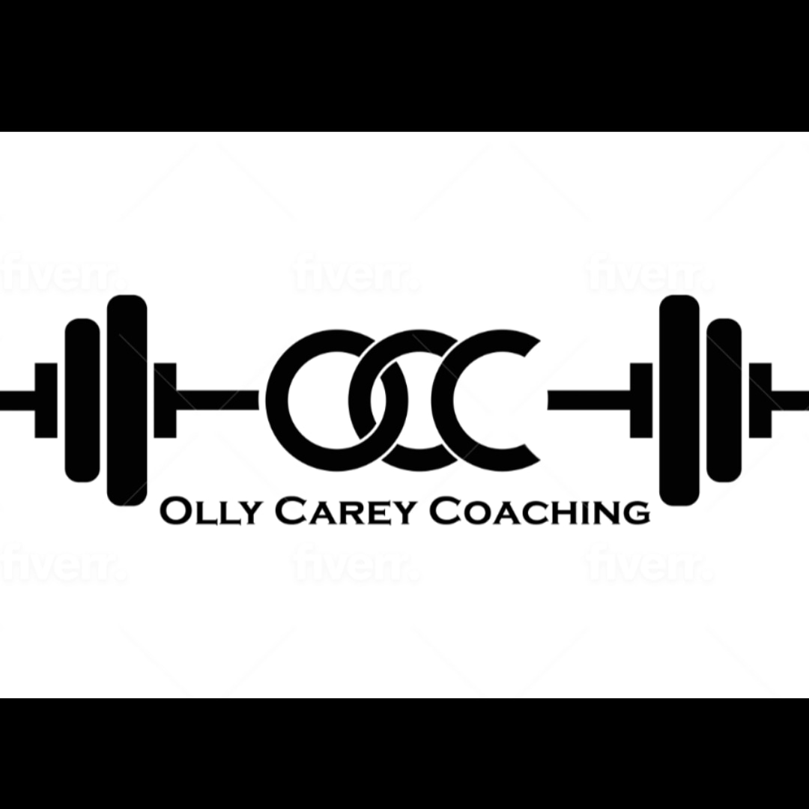

# Motivate Fitness
This is an appoinment booking application for an online personal training service.

You can visit the live site [here](https://pt-booking.herokuapp.com/)

## Contents
- [User Experience](#user-experience)
    - [User Stories](#user-stories)
    - [Agile Methodology](#agile-methodology)
    - [Wireframes](#wireframes)
    - [Database](#database)
    - [Design](#design)
- [Features](#features)
    - [Existing Features](#existing-features) 
    - [Future Features](#future-features)
- [Technologies](#technologies)
    - [Languages and Frameworks](#languages-and-frameworks)
    - [Technologies Used](#technologies-used)
    - [Libraries](#libraries)
- [Testing](#testing)
    - [Validator Testing](#validator-testing)
    - [Lighthouse Testing](#lighthouse-testing)
    - [Manual Testing](#manual-testing)
- [Bugs](#bugs)
- [Deployment](#deployment)
- [Credits](#credits)
- [Acknowledgements](#acknowledgements)

### **Agile Methodology**
#### **GitHub Project Board**

* This project was made using agile methodologies. Epics, user stories, bugs and issues are recorded on the [Project Board](https://github.com/users/HPCarey/projects/4/views/1)

[Back to top](#contents)

## **User Experience**
### **User Stories**
* Epics, site user stories and admin user stories can be seen on the [project board](https://github.com/users/HPCarey/projects/4/views/1)

[Back to top](#contents)

### **Wireframes**
Wireframes were created using Balsamiq.

See [Wireframes.](static/readme/pt-booking-app.pdf)

[Back to top](#contents)

### **Database**
[Lucid chart](https://www.lucidchart.com/pages/) was used to make the entity relationship diagram showing my custom models and the user model which is built with Django AllAuth. Lucid chart was also used to make the flow chart mapping out the user journey throuh the site. 

[Back to top](#contents)
### **Design**
#### **Typography**
* [Font awesome](https://fontawesome.com/)
* I used [figma](https://www.figma.com/file/RgYErSjELw326fP4MH6jt4kT/Nunito-Pairings/duplicate?node-id=1%3A198) to check what fonts pair well with Nunita and ended up going with Roboto.

#### **Images**
 
* Hero Images were taken from 
    * [Pexels](https://www.pexels.com/photo/man-working-out-2294361/)

#### **Colour Scheme and Accessibility**
 * First I uplaoded the hero image to [colormind](http://colormind.io/image/)to generate a few different palettes.

 * Input these hex values into the contrast grid on [Eightshapes](https://contrast-grid.eightshapes.com/) to check the WCAG 2.0 minimum contrast scores which helped me to pick a background and foreground colour that meet the accessibility requirements for good UX.

 

 

 

[Back to top](#contents)
## **Features**
### **Existing Features**
### **logo**
* Logo provided by site owner for his business

#### **Navigation Bar**
* The navigation bar is featured on all pages of the site. 
* The Login link changes to Logout depending on user authorisation.
* The account link takes you to the login page.
* When user is logged in, the account link becomes a my profile dropdown menu giving logged in users access to their booking information via the user profile page and a logout link. 
* The logo acts as a home link as well as the home-nav link.
* The nav bar is fully responsive using bootstrap and becomes collapsable for mobile and tablet.

 

[Back to top](#contents)

#### **Landing page**
* The landing page features the hero image.
* There is also a text overlay on the hero image with a call to action "Book Now!" button, as well as a short description of what's on offer.
* The book now button takes authorised user's to the booking form, but unauthorised user's are directed to the login form.

#### **Footer**
* The footer contains links social media as well as copyright information.

[Back to top](#contents)
#### **Login Page**
* The login page was built using Django AllAuth. 
* I imported the template and gave it some basic styling using bootstrap. I also extended my base template so the user stays on the page when logging in and changed the text.
* The login page contains a link to the sign-up page so new users can register their accounts.

[Back to top](#contents)
#### **Sign Up Page**
* The sign up page is also from the authentication module allauth. 
* I imported the template and gave it some basic styling using bootstrap.
* Once signed up the user is redirected to the home page.

[Back to top](#contents)
#### **Booking Page**
* The place booking page is only accessible when logged in. If you are not logged in you will get redirected to the login page instead.
* The form contains all the necessary fields for the trainer to prepare for the consultation.
* The datepicker is the standard HTML element for picking dates. 
* In the model, there is a function to validate that the booking can't be done on a date in the past. 
* In the form itself there is also a validation that disables dates that are closer than two days in the future. 
* There is also a limit that you can't book more than 60 days in advance

[Back to top](#contents)

#### **User Profile**
* A page where the user can view their upcoming appointments with the trainer.
* There is a cancel and change button for each appointment that takes the user to a new page to complete either of those actions. 

* When the user clicks "change" they are brought to a change appoinmtent form, which shows the date

* When a user tries to cancel a booking, they are taken to a confirmation page first and aske dto press the cancle button to confirm delete.

[Back to top](#contents)

#### **Admin**
* The trainer/admin can view, edit and delete all bookings via the admin panel.
* They can view relevant information regarding the clients gender, health conditions and goals so that they can prepare for the pt session.
* They can  also add appointments in the case that an appointment is made over the phone or via social media messaging apps. 
* The trainer also has the ability to confirm a booking.

[Back to top](#contents)

### **Future Features**
* For now the client only wants a simple promotional site with a call to action in order to attract potential clients, but in the future as their online clientele grows, the site could feature a services/programmes section which could detail various packages, services and price points.
* A personal information section in the profile UI that clients can update and edit in order to communicate there need and changing circumstances with trainers. 
* An onsite payment system using stripe so that the trainer can take payments upfront for consultations, programmes and online one-to-one training sessions.
* A UI for the trainer which would allow them to manage bookings without having to go through the django admin panel.
* Email confirmation of confirmed appointments and for the registration process.
* A link to goodle calendar API to help users and admin keep track of appointments outside the app. 

[Back to top](#contents)
## **Technologies**
### **Languages and Frameworks** 
* [Django](https://www.djangoproject.com/) 
* [Bootstrap](https://getbootstrap.com/)
* [HTML5](https://en.wikipedia.org/wiki/HTML)
* [CSS3](https://en.wikipedia.org/wiki/CSS) 
* [JavaScript](https://en.wikipedia.org/wiki/JavaScript) 
* [Python](https://en.wikipedia.org/wiki/Python_(programming_language))

[Back to top](#contents)

### **Technologies Used** 
* [Gitpod](https://gitpod.io/)
* [Balsamiq](https://balsamiq.com/) 
* [Cloudinary](https://cloudinary.com/) 
* [Heroku](https://dashboard.heroku.com) 
* [ElephantSQL](https://www.elephantsql.com/)
* [PEP8 Validation](http://pep8online.com/)
* [HTML Validation](https://validator.w3.org/)
* [CSS Validation](https://jigsaw.w3.org/css-validator/) 
* [JSHint Validation](https://jshint.com/) 
* [Lucid chart](https://www.lucidchart.com/pages/)
* [Font awesome](https://fontawesome.com/)
* [Pairfonts](https://pairfonts.com/)
* [Google fonts](https://fonts.google.com/)
* [Balsamiq](https://balsamiq.com/wireframes/)
* [Github](https://github.com/)
* [Gitpod](https://gitpod.io/)
* [Tiny PNG](https://tinypng.com/)
* [Pixabay](https://pixabay.com)
* [Unsplash](https://unsplash.com)
* [Pexels](https://www.pexels.com)
* [Eightshapes](https://contrast-grid.eightshapes.com/)
* [rgbacolorpicker](https://rgbacolorpicker.com/hex-to-rgba)
* [Am I responsive](https://ui.dev/amiresponsive)

[Back to top](#contents)
### **Libraries**
The following libraries are used in the project and are located in the requirements.txt file.

[Back to top](#contents)

[Back to top](#contents)

## **Bugs**

* I have recorede details of bugs and solutions in the project boars user stories:
[Project Board](https://github.com/users/HPCarey/projects/4/views/1)

[Back to top](#contents)
## **Deployment**

### Steps to deploy:

#### **Gitpod**

1. Create a repository in github using the [Code Institute template](https://github.com/Code-Institute-Org/python-essentials-template). 
2. Click Use this Template and add a repository name.
3. Click Create Repository from template
4. While using this template ensure all inputs have \n to ensure deployment to heroku.
5. In terminal type pip3 freeze > requirements.txt press enter to update this file.
6. Add, commit and push all changes to github before starting steps to deploy to Heroku

#### **Heroku**
1. Log in to [Heroku](https://pt-booking.herokuapp.com).
2. From the dashboard, click the button labelled New in the top right corner and from the drop-down menu select Create New App.
3. Enter a name for the app and select your region.
4. Click Create App.                  
5. Find the Settings Tab and scroll down to Config Vars.
6. Click Reveal Config Vars and enter PORT into the Key box and 8000 into the Value box before clicking Add. 
7. Scroll down to the Buildpack section click Add Buildpack.
8. Select python and click Save Changes.
9. Next select node.js and Save Changes. 
10. Ensure python is the first buildpack listed and is above node.js.
11. Scroll to the top of the page and navigate to the Deploy tab.
12. Select Github as the deployment method.
14. Search for the repository name and click the connect button.
15. Scroll to the bottom of the deploy page and select Enable Automatic Deploys. 

[Back to top](#contents)

## **Credits**
I used the following resources to help me plan, build and fix bugs in my project.

### Design and UI sources
Hero Image
* [Taken from Pexels from Li Sun](https://www.pexels.com/@823sl/)
* [Set responsive background image using bootstrap](https://www.youtube.com/watch?v=aw2Zj7jXNcU&ab_channel=TechHub) : 

* [Responsive Background Images w/ Bootstrap 5 (in HTML/CSS)](https://www.youtube.com/watch?v=W87XNjvXiWw&ab_channel=ADesignerWhoCodes) 

* [Responsive Bootstrap Website Tutorial with Full Screen Landing Page](hhttps://www.youtube.com/watch?v=Zn64_IVLO88&ab_channel=DrewRyan):
This video helped me to research project ideas and 
:
This tutorial for setting up email with Django using Gmail.

### Code Credits and Sources:
1. This project was created using the guidelines from the Hello Django and I think therefore I blog walkthrough projects and the django blog start files from Code Institute.

* [Starter Files](https://github.com/Code-Institute-Solutions/django-blog-starter-files)

2. The following tutorial was used as inspiration to plan my project.

* [Django Tutorial](https://blog.devgenius.io/django-tutorial-on-how-to-create-a-booking-system-for-a-health-clinic-9b1920fc2b78)

3. The following article helped me create the dropdown menu for the gender option in the appoinments model.
* [Stack Overflow](https://stackoverflow.com/questions/31130706/dropdown-in-django-model)

4. This tutorial helped with creating a template view for delete confirmation.
* [openclassrooms](https://openclassrooms.com/en/courses/6967196-create-a-web-application-with-django/7349788-delete-objects-safely-with-user-confirmation)

5. Sources used for the datetime picker UI
* [Stack Overflow](https://stackoverflow.com/questions/55404397/how-to-use-timeinput-widget-in-django-forms)
* [Stack Overflow](https://stackoverflow.com/questions/51022722/how-to-restrict-date-and-time-in-django-bootstrap-datetimepicker-plus)

### Code Institute project sources:
I'd also like to mention some of the projects of my fellow CI studens which helped me plan and execute parts of my project
* [NailsbyFaar](https://github.com/DOdrums/PortfolioProjectFour/tree/main/salon) by [Dirk Ornee](https://github.com/DOdrums)

* [Locksmith Booking](https://github.com/spangen87/locksmith-booking) by [spangen87](https://github.com/spangen87)
* [Sandra's Kitchen](https://github.com/devisis/sandras-kitchen) by [DevIsis](https://github.com/devisis)

[Back to top](#contents)
## **Acknowledgements**

To my mentor and everyone who offered advice and support on slack.