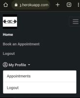

# Testing
* [Back to README Home page](/README.md)
#

- [Responsive Testing](#responsiveness-testing)
- [User Stories Testing](#user-stories-testing)
- [Validator Testing](#validator-testing)
- [Lighthouse Testing](#lighthouse-testing)
- [Manual Testing](#manual-testing)

## USER STORIES TESTING

👇

The User Stories and features were continuously tested during development and this testing was documented here and with screenshots of the features from the deployed site.

There are several screenshots of the features in the [README.md](README.md) file.

### Epic 1: User Authorisation

- - -

 

#### **User Stories**
1. As a **Site Owner** I can **display a landing page with some promotional content to all users in the form of images, slogans and a call to action button inviting them to book a free anppointment and create an account** so that **I can attract new clients**
    - Landing page for new users displays visual and textual cues for the purpose of the site
    - Includes a call to action button and navbar links specific to new user actions
    - Fully responsive and user friendly in smaller screens

    

    

#
2. As a **Site User** I can **I can register an account** so that **I can make a booking**

    - All navlinks and buttons on the landing page will take logged out user to the sign in page.
    - If user is new user, sign in page contains a link to the sign up page
    - Sign up page allows new user to create an account and new user gets added to backend database

    
    

#

3. As a **Site User** I can **login** so that **I can make an appointment and/or view my profile and scheduled appointments**.
    - All navlinks and buttons on the landing page will take logged out user to the sign in page.

     
    
    - Once a user is logged-in the Navbar will change to reflect this status and the account dropdown will display My Profile.
    - Login buttons will become Logout buttons for logged in users

    
    
    

    - The My Profile dropdown will now give users access to an appointments navlink 

    

    

#
4. As a **Site User** I can **navigate through the site pages** so that **I can take actions and view information**
    - All navlinks and buttons take logged in users to the correct location.
    - Navlinks have django tags to conditionally render active class changing color of the navlink to white ifuser is on that page.
    - The "Book Now" button and the "Book an Apppointment" navlink will take logged in users to the booking form.
    
    

    - The Appointments navlink in the My Profile dropdown takes logged in user to their Appointments page. 
    - New users will see a message that there are no appointments and a "book an appointment" button that will take them to the booking form.

    

#

5. As a **Site Admin** I can **create, read, update and delete bookings through the django admin panel** so that **I can manage my client bookings.** 
    - The admin panel can be accessed by those with the superuser credentials.

    

    - The admin panel allows the site owner to keep track of users, appoinment dates and times as well as the ability to search using the clients first name, last name or email. 
    - The site owner or admin can also delete, update and add bookings manually if a client books over the phone.

    

    

    

   

### Epic 2: Add a Booking 

- - -

 

#### **User Stories**
1. As a **Site User** I can **click the book appointment button on the landing page and/or navbar** so that **I can fill in a form to book an appointment with the trainer.**

    - Authorised user can view the booking form and submit a booking.
    - The form contains a submit button which will make a post request and save the booking if form is valid.
    - The form contains a cancel button which redirects straight to the Appoinmtents page in case the user changes their mind.

    
    
            
#
2. As a **Site User** I can **pick a date and time** so that **I can reserve a timeslot for my appointment.**

    - The form has a date and time field for users to pick their timeslot.

     
    
    
    

    - The date field will throw an error
#

3. As a **Site User** I can **view my profile page** so that **I can see my upcoming appointments**

    - Once the user has submitted a booking form with no validation errors, it will be saved to the database.
    - A user's saved bookings are displayed in the user's My Appoinments page in their profile.

     
    

#   

### Epic 3: Edit Functionality

- - -

 

#### **User Stories**
1. As a **Site User** I can **use the change button** so that **I can edit an appointment on my profile to a different date/time**

    - Authorised user can view the booking form and submit a booking.
    - The form contains a submit button which will make a post request and save the booking if form is valid.
    - The form contains a cancel button which redirects straight to the Appoinmtents page in case the user changes their mind.

    
    
            

#   

### Epic 4: Delete Functionality

- - -

 

#### **User Stories**
1. As a **Site User** I can **cancel appointments** so that **I can delete an appointment from my profile**

    - Authorised user can view the booking form and submit a booking.
    - The form contains a submit button which will make a post request and save the booking if form is valid.
    - The form contains a cancel button which redirects straight to the Appoinmtents page in case the user changes their mind.

    
    
            

#   

- - -

## FEATURES TESTING

👇

The features were manually tested as defensive programming during the development of this project and also after it was finished with the below user acceptance testing:

 Video recorded with testing:
  

| Page | User Action | Expected Result| Notes |
| --- | --- | --- | --- |
|  **Home Page**   |  |  | |
| Landing | Click on Logo | Redirection to Home page | Pass |
| | Click on Sign Up button  | Redirection to Sign Up page | Pass |
| | Click on Sign In button | Redirection to Sign In page | Pass |
| Logged in | Click on Logo | Redirection to Main Feed | Pass |
| **Sign Up** |  |  |  |
| | Enter valid email address | Field will only accept email address format | Pass |
| | Enter valid password (twice) | Field will only accept password format | Pass |
| | Click Sign Up button on sign up page  | Redirects user to feed and displays message | Pass |
| | Click on Sign In link | Redirection to Sign In page | Pass |
| **Sing In** |  |  |  |
| | Enter valid email address | Field will only accept email address format or valid username | Pass |
| | Enter valid password | Field will only accept password format | Pass |
| | Click Login button on login page | Redirects user to main feed and displays message | Pass |
| | Click Forgot Password | Redirects user to password reset page | Pass |
| | Click on Sign Up link | Redirection to Sign Up page | Pass |
| **Sing Out** |  |  |  |
| | click on dropdown menu, then sign out | Redirects to sign out page | Pass |
| | Click to confirm to sign out  | Redirects to landing page and displays message with the sign out confirmation | Pass |
| **Password Reset**|  |  |  |
| | Enter valid email address and click Reset Password button| Request confirmation | Pass |
| | Receive email with link to reset password | The link to reset the password is valid | Pass |
| | Click on the reset password link | Redirects user to change his password | Pass |
| | Attempt to use the reset password link twice | The link won't be accepted | Pass |
| **Main Feed** |  |  |  |
| | Create a post only with text as content | New post only with text is created | Pass |
| | Create a post only with picture | User is prompted to type something into the content field before sending | Pass |
| | Create a post with text and picture | New post with text and picture is created | Pass |
| | Click send on new post form without adding content | User is prompted to enter something into the field before sending | Pass |
| | Click on a post | User will be redirected to the post detail page | Pass |
| | Click on the username on a post | User will be redirected to the post author's profile | Pass |
| | Click the like button on a post | Like button will fill with colour and the like count will increase by 1, Post author receives a notification letting them know someone has liked their post | Pass  |
| | Click the like button on a post already liked by the user | Like button will become clear in the middle like count will decrease by 1 | Pass |
| | Click the dislike button on a post | Dislike button will fill with colour and the dislike count will increase by 1 | Pass  |
| | Click the dislike button on a post already liked by the user | Dislike button will become clear in the middle dislike count will decrease by 1 | Pass  |
| | Click edit icon on own post | User is redirected to post edit page | Pass   |
| | Click delete icon on own post | User is redirected to post delete confirmation page | Pass  |
| | Click on the pagination | Change the pages correctly | Pass |
| **Following Feed** |  |  |  |
| | Display only post from users who are being followed | User reads only posts of the users he follows | Pass |
| | The user is not following anyone and click on Following | Message to try follow other users | Pass |
| | Click on a post | User will be redirected to the post detail page | Pass |
| | Click on the username on a post | User will be redirected to the post author's profile | Pass |
| | Click the like button on a post | Like button will fill with colour and the like count will increase by 1, Post author receives a notification letting them know someone has liked their post | Pass  |
| | Click the like button on a post already liked by the user | Like button will become clear in the middle like count will decrease by 1 | Pass |
| | Click the dislike button on a post | Dislike button will fill with colour and the dislike count will increase by 1 | Pass  |
| | Click the dislike button on a post already liked by the user | Dislike button will become clear in the middle dislike count will decrease by 1 | Pass   |
| | Click edit icon on own post | User is redirected to post edit page | Pass  |
| | Click delete icon on own post | User is redirected to post delete confirmation page | Pass  |
| | Attempt to delete a post as admin | Admin is redirected to delete page | Pass |
| | Click on the pagination | Change the pages correctly | Pass |
| **Edit Post** | | | | 
| | Fill in post form and click submit | Original post can be edited | Pass | 
| | Click on the Back To Post button | User will be redirected to the original post | Pass | 
| **Delete Post** | | | | 
| | Click on the Delete button | Post will be permanently deleted | Pass | 
| | Click on the Back To Post button | User will be redirected to the original post | Pass | 
| **Comments on Post Detail** | | | | 
| | Comment a post | New comment is created, the post author is notificated | Pass |
| | Click send on new comment form without adding content | User is prompted to enter something into the field before sending | Pass |
| | Click the like button on a comment | Like button will fill with colour and the like count will increase by 1, Post author receives a notification letting them know someone has liked their post | Pass  |
| | Click the like button on a post already liked by the user | Like button will become clear in the middle like count will decrease by 1 | Pass |
| | Click the dislike button on a post | Dislike button will fill with colour and the dislike count will increase by 1 | Pass  |
| | Click the dislike button on a post already liked by the user | Dislike button will become clear in the middle dislike count will decrease by 1 | Pass   |
| | Click edit icon on own comment | User is redirected to comment edit page | Pass  |
| | Click delete icon on own comment | User is redirected to comment delete confirmation page | Pass  |
| | Click on the username on a comment | User will be redirected to the comment author's profile | Pass | 
| | Click on the comment icon | Open a form to reply the comment | Pass | 
| | Click edit icon on own comment | User is redirected to comment edit page | Pass | 
| | Click delete icon on own comment | User is redirected to comment delete page | Pass | 
| | Click on the pagination | Change the pages correctly | Pass |
| | Attempt to delete a comment as admin | Admin is redirected to  delete page | Pass |
| | Brute forcing the URL to delete another user's comment if not on your post | Redirects user to error page | Pass | 
| **Edit Comment** | | | | 
| | Fill in comment form and click submit | Original comment will be edited | Pass | 
| | Click on the Back To Post button | User will be redirected to the original post | Pass | 
| **Reply on Post Detail** | | | | 
| | Reply a comment | New reply is created, the comment author is notificated | Pass |
| | Click delete icon on own reply | User is redirected to  delete page | Pass | 
| | Attempt to delete a post as admin | Admin is redirected to  delete page | Pass |
| **Delete Comment or Reply** | | | | 
| | Click on the Delete button | Comment or reply will be permanently deleted | Pass | 
| | Click on the Back button | User will be redirected to the original post | Pass | 
| **Own Profile** | | | | 
| | Click on Profile button in dropdown menu | User will be redirected to their Profile page | Pass | 
| | Click on the Edit icon | User will be redirected to the edit profile page | Pass | 
| | Click on the Back To Feed button | User will be redirected to main feed | Pass | 
| | Click on followers | User will be redirected to followers list page | Pass | 
| | Click on a post | User will be redirected to the individual post page | Pass | 
| | Click edit icon on own post | User is redirected to post edit page | Pass | 
| | Click delete icon on own post | User is redirected to post delete confirmation page | Pass | 
| | Click on the pagination | Change the pages correctly | Pass |
| **Update Profile** | | | | 
| | Attempt to update the data (Name, bio, location, birthdate, profil and background pictures) | The information are saved correctly | Pass | 
| | User didn't upload pictures | Default pictures are used | Pass |
| | Click on change password | User will be redirected to change password page | Pass | 
| | Brute forcing the URL to edit another user's profile | Redirects user to error page | Pass |
| **Change Password** | | | | 
| | Attempt to change password, type the old password and the new twice | The password is changed successfully | Pass | 
| **Other Profile** | | | | 
| | Click on the follow button | User will follow current profile they're on and button will change to say unfollow, profile owner receives a notification letting them know someone has followed them and followers count will increase by 1 | Pass |  
| | Click on the unfollow button | User will unfollow current profile they're on and button will change to say follow, followers count will decrease by 1 | Pass | 
| | Click on followers | User will be redirected to followers list page | Pass |  
| | Click on the back button | User will be redirected to their feed | Pass | 
| | Click on a post | User will be redirected to the  post detail page | Pass | 
| | Click on the pagination | Change the pages correctly | Pass |
| **Followers Page** | | | | 
| | Click on user's name | User will be redirected to  user's profile | Pass |
| | Click on the pagination | Change the pages correctly | Pass |
| **Search Page** | | | | 
| | Type text into search form into nav and click the search icon | User is directed to a page with a list of  users containing his search query | Pass | If there are no users and/or posts containing the query the page will let the user know there was no results in either or both for their query |
| | Search for a non-existing user | Message  no User was found and to try again | Pass |
| | Click search icon with empty input | Redirects to users list | Pass |
| | Click on user's name | User will be redirected to  user's profile | Pass | 
| | Click on the pagination | Change the pages correctly | Pass |
| **Users Page** | | | | 
| | Click on user's name | User will be redirected to  user's profile | Pass |
| | Click on the pagination | Change the pages correctly | Pass |
| **Notifications** | | | | 
| | Click on like notification | User will be redirected to post detail from the liked post, the counter decrease by 1 | Pass |
| | Click on following notification | User will be redirected to  user's profile who started following him, the counter decrease by 1 | Pass |
| | Click on comment notification | User will be redirected to post detail from the comment, the counter decrease by 1 | Pass |
| | Click on reply notification | User will be redirected to post detail from the comment, the counter decrease by 1 | Pass |
| | Click on X | The notification will be closed, the counter decrease by 1 | Pass |
|**Error Pages** | | | | 
| | Click on Home button | User will be redirected to his feed | Pass | 
|**Footer** | | | | 
| | Click on Linkedin Icon | Redirects to LinkedIn from the creator of this application | Pass |
| | Click on GitHub Icon | Redirects to GitHub repository | Pass |
| | Click on "Lucimeri Andretta" link | Redirects to GitHub from the creator of this application | Pass |

- - -
1. HTML
* HTML validation was done using [W3C Markup validator](https://validator.w3.org/)
* Some initial errors:
    * A....
        * This error is as a result of 
    * Another error showed ...

2. CSS
* CSS Validation was done using [Jigsaw](https://jigsaw.w3.org/css-validator/)

* No bugs were found in the CSS at the final tetsing stage as I had been testing throughout development and CSS bugs were common and obvious in the gitpod browser so were quickly identified and fixed.

4. Python 

[PEP8 Online Validator](http://pep8online.com/)

[Back to top](#contents)
### **Lighthouse Testing**
 * Initial results showed 
    * I addressed this issue by 
* The ligthouse results for mobile showed 
* The final lighthouse results showed 

#### Lighthouse results

#### Lighthouse mobile results

#### Lighthouse final results

#### Lighthouse mobile final results

[Back to top](#contents)

### **Manual Testing**

* All links are working.
* Clicking on the logo gets you back to the home page.
* If you try to access a page which requires the user to be logged in, you are redirected to the login page.
* An alert is shown everytime a user tries to delete something.
* A confirmation message is shown every time an action is performed.
* All CRUD (Create, Read, Update, Delete) functionality is working as it should.
* All forms have validation for the required fields.