# Testing
* [Back to README Home page](/README.md)
#
- [Manual Testing](#manual-testing)
    - [Responsive Testing](#responsive-testing)
    - [Lighthouse Testing](#lighthouse-testing)
    - [Browser Testing](#browser-testing)
    - [User Stories Testing](#user-stories-testing)
    - [Features Testing](#features-testing)
    
- [Code Validation](#code-validation)

## **Manual Testing**

* This site was tested manually by:
    - Testing the UI and functionality of features for different device sizes and browsers.
    - Evaluating performance and loading times using lighthouse and interacting wiht the site as a user.
    - Ensuring that user story features are functioning as they should be with the expected outcome from specific user actions.
    - All links and user pathways function as intended and navigate the user as expected through the site.
* The details of how the manual testing was carried out can be seen below.
* I have also included the code validation in the TESTING document.

## Responsive Testing

👇

* Site resonsivity was tested using google chrome DevTools and with my own Galaxy S20 FE 5G.
* The screenshot below shows a list of the devices that were tested. 

    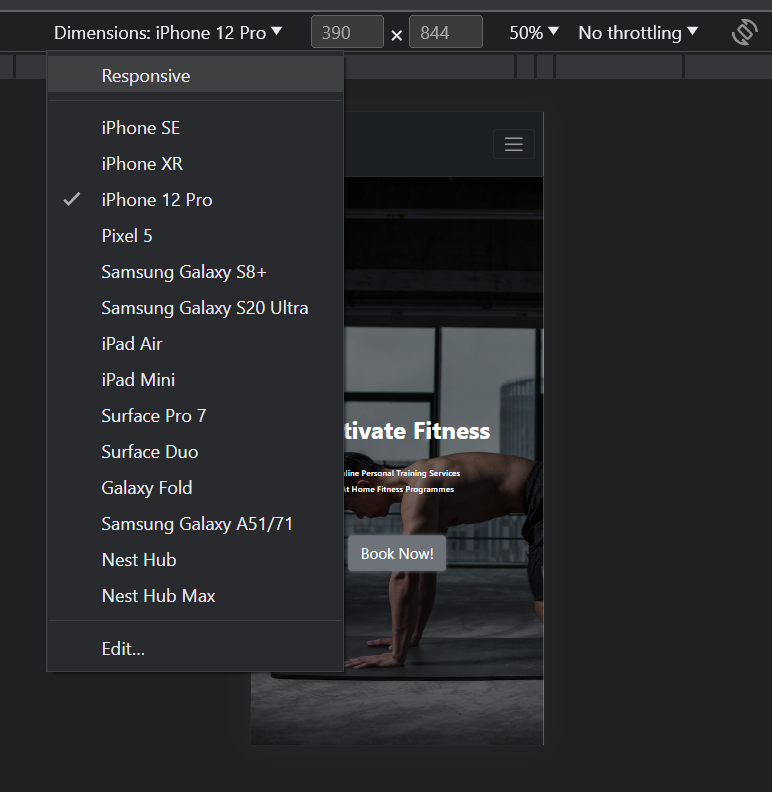

* The site was shown to be fully responsive, readable and functional on all of the tested devices.
* One minor issue showed up with the buttons on the update form page which did not display side by side but rather one above the other on the Surface Pro, iPad mini, iPad Air and the Galaxy fold. This appeared to be a minor issue only affecting UI design and not functionality or readability. On most devices it displayed correctly.

* Site resposivity was also tested on Amiresponsive as seen in the README.
* I also included some screenshots of features in mobile size in the user story testing to show the responsive design. 

[Back to top](#testing)

- - -
## Lighthouse testing

👇

* Lighthouse testing in chrome DevTools showed an overall performance of 99% and good SEO and Accessibility scores.
* There were some suggestions to improve best practice scores which will be added to the future features for this site.

    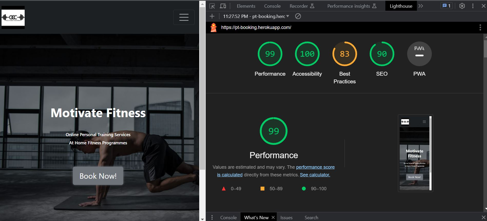

[Back to top](#testing)

- - -

## Browser testing

👇

* The site was developped using Google Chrome browser and tested in Firefox and Microsoft Edge.

[Back to top](#testing)

- - -

## User Stories Testing

👇

The User Stories and features were continuously tested during development and this testing was documented here and with screenshots of the features from the deployed site.

### Epic 1: User Authorisation

User Stories test cases

 

#### **User Stories**
1. As a **Site Owner** I can **display a landing page with some promotional content to all users in the form of images, slogans and a call to action button inviting them to book a free anppointment and create an account** so that **I can attract new clients**
    - Landing page for new users displays visual and textual cues for the purpose of the site
    - Includes a call to action button and navbar links specific to new user actions
    - Fully responsive and user friendly in smaller screens

    

    

[Back to top](#testing)

#
2. As a **Site User** I can **I can register an account** so that **I can make a booking**

    - All navlinks and buttons on the landing page, other than home and the logo, will take logged out user to the sign in page.
    - Site authentication is handled by django AllAuth.
    - If user is new user, sign in page contains a link to the sign up page.
    - Sign up page allows new user to create an account and new user gets added to backend database.
    - Sign up form field errors are handled by django AllAuth.

    
    

    - Once a new user successfully signs up then:
        1. User will be automatically signed in. 
        2. they are redirected to the homepage.
        3. A success message is displayed.

    

[Back to top](#testing)
#

3. As a **Site User** I can **login** so that **I can make an appointment and/or view my profile and scheduled appointments**.
    - All navlinks and buttons on the landing page will take logged out user to the sign in page.
    - All signin form field errors are handled by django AllAuth.

     
    
    - Once a user is logged-in the Navbar will change to reflect this status and the account dropdown will display My Profile.
    - Login buttons will become Logout buttons for logged in users

    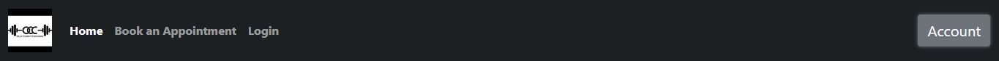
    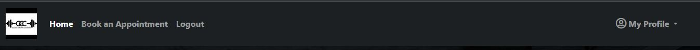
    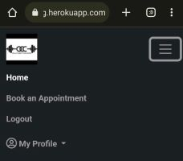

    - The My Profile dropdown will now give users access to an appointments navlink 

    

    

[Back to top](#testing)
#
4. As a **Site User** I can **navigate through the site pages** so that **I can take actions and view information**
    - All navlinks and buttons take logged in users to the correct location.
    - Navlinks have django tags to conditionally render active class changing color of the navlink to white if user is on that page.
    - The "Book Now" button and the "Book an Apppointment" navlink will take logged in users to the booking form.
    
    

    - The Appointments navlink in the My Profile dropdown takes logged in user to their Appointments page. 
    - New users will see a message that there are no appointments and a "book an appointment" button that will take them to the booking form.

    

    - The Logout navlink will take users to a confirmation page

    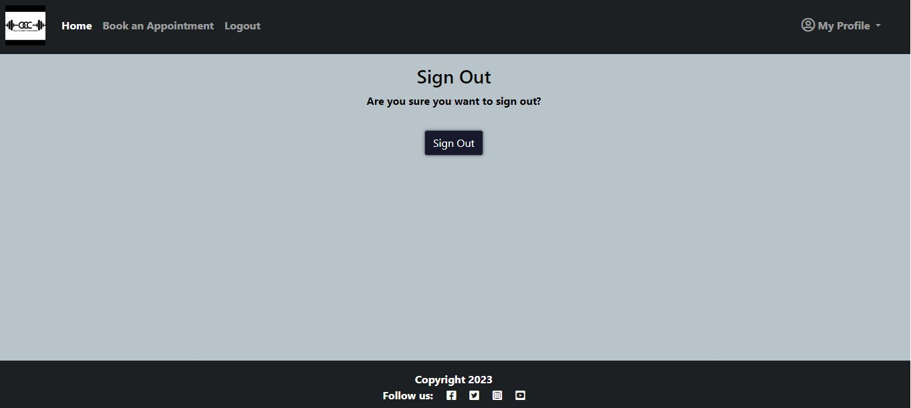
    

    - If the user chooses to click the sign out button on the confirmation page then:
        1. User will be logged out and lose access to other profile and form pages.
        2. User will be redirected to the home page and see the logged out version of the navbar.
        3. A success mesaage will confirm to the user that they have been logged out.

    

[Back to top](#testing)

#

5. As a **Site Admin** I can **create, read, update and delete bookings through the django admin panel** so that **I can manage my client bookings.** 
    - The admin panel can be accessed by those with the superuser credentials.

    

    - The admin panel allows the site owner to keep track of users, appoinment dates and times as well as the ability to search using the clients first name, last name or email. 
    - The site owner or admin can also delete, update and add bookings manually if a client books over the phone.

    

    

    

[Back to top](#testing)

- - -

### Epic 2: Add a Booking 

User Stories test cases

 

#### **User Stories**
1. As a **Site User** I can **click the book appointment button on the landing page and/or navbar** so that **I can fill in a form to book an appointment with the trainer.**

    - Authorised user can view the booking form and submit a booking.
    - The form contains a submit button which will make a post request and save the booking if form is valid.
    - The form contains a cancel button which redirects straight to the Appoinmtents page in case the user changes their mind.

    
    

    - If some form fields are left blank or are invalid, the booking will not be saved.
    - The form handles custom error messages for:
        1. Duplicate bookings

        

        2. Booking a date in tha past 
        3. Client age is below 18 or over 90

        
        

    - Django handles other form validation isssues, like empty fields and prevents user from entering too many characters.

    

    - If the form is valid then:

        1. The booking instance will be saved
        2. The user will be redirected to their appointments page where they can view all their bookings.
        3. A success message will inform the user that they successfully booked an appointment

    

[Back to top](#testing)
#
2. As a **Site User** I can **pick a date and time** so that **I can reserve a timeslot for my appointment.**

    - The form has a date and time field for users to pick their timeslot.

     
    
    
    

    - As shown above, an error will be shown in the event that a user selects a date for which they already have a booking or if the select a date in the past. 

[Back to top](#testing)
#

3. As a **Site User** I can **view my profile page** so that **I can see my upcoming appointments**

    - Once the user has submitted a booking form with no validation errors, it will be saved to the database.
    - A user's saved bookings are displayed in the user's My Appoinments page in their profile.

     
    

[Back to top](#testing)

- - -

### Epic 3: Edit Functionality

User Stories test cases

 

#### **User Stories**
1. As a **Site User** I can **use the change button** so that **I can edit an appointment on my profile to a different date/time**

    - Authorised user can view their appointments in their Appointments page.
    - Each appointment displays a change and delete button as seen in the previous test case pictures.
    - When a user clicks the change button they will be redirected to an edit form containing the fields related to the appoinment information.
    - The fields will be prepoulated with the appointment data.

    
   
    - Like the add booking form, the edit booking form prevents users from booking a duplicate date excluding the date of the form being edited in case the user wants to edit another field and keep that date.
    - If the booking is a duplicate the form will not save and will throw an error to the user explaining the problem with the duplicate date.

    

    - The edit form will also prevent user from booking a date in the past.

    

    - The edit form contains 2 buttons, one to submit changes and one to "Don't change".

    

    - If the user clicks don't change, they will be redirected back to their appoiments page without saving any changes.
    - If the user clicks Submit changes and there are no field errors in the form then:
        1. The changes will be saved to the booking instance.
        2. The user will be directed to the appointments page with the updated appoinment data.
        3. A success message will be displayed to the user.

    

[Back to top](#testing)

- - -

### Epic 4: Delete Functionality

User Stories test cases

 

#### **User Stories**
1. As a **Site User** I can **cancel appointments** so that **I can delete an appointment from my profile**

    - Authorised user can view their appointments in their Appointments page.
    - Each appointment displays a change and delete button as seen in the previous test case pictures.
    - There is defensive programming in place to prevent users from accidentally deleting an appointment.
    - If a user clicks the delete button, they will be redirected to a confirmation page where they will be asked to confirm their delete decision.

    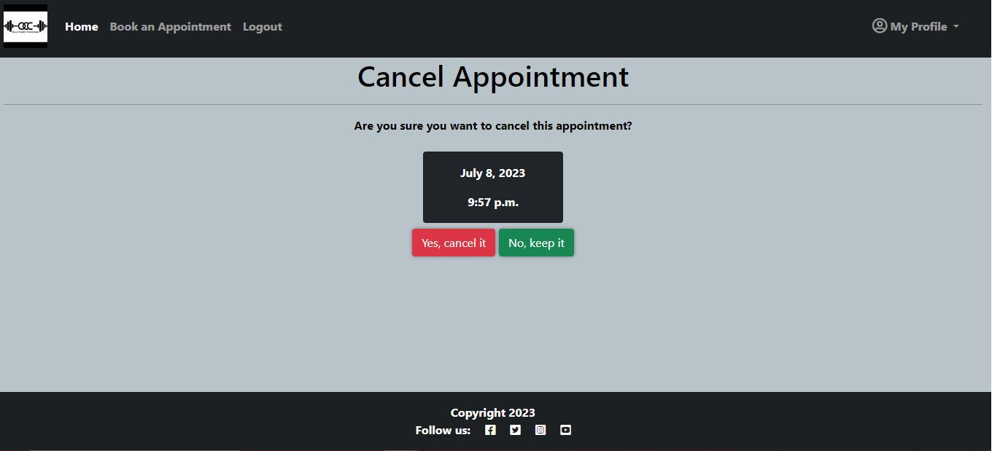
    

    - If the user clicks "No Keep it", they will be redirected to the appointments page.
    - If the user clicks "Yes, cancel it" then:
        1. The booking instance will be deleted.
        2. The user will be redirected back to the appointments page.
        3. A success message will be displayed confriming the cancellation of the appoinment.
    

[Back to top](#testing)

- - -

## Features Testing

👇

The features were manually tested during the development of this project and also after it was finished with the below user acceptance testing:

| Page | User Action | Expected Result| Notes |
| --- | --- | --- | --- |
|  **Home Page**   | |  | |
| All users | Click on Logo | Redirect to Landing page | Pass |
| All users | Click on Home Navlink | Redirect to Landing page | Pass |
| Logged-out users | Click on Book an Appointment Navlink | Redirect to Sign In Page | Pass |
| Logged-out users | Click on Book Now! button | Redirect to Sign In Page | Pass |
| Logged-out users| Click on Login Navlink  | Redirection to Sign In page | Pass |
| Logged-out users| Click on Sign Up link on Sign in page | Redirect to Sign Up page | Pass |
| Logged-out users| Click on Account button | Redirect to Sign In page | Pass |
| Logged-in users | Click on Book an Appointment Navlink | Redirect to booking form | Pass |
| Logged-in users | Click on Book Now! button | Redirect to booking form | Pass |
| Logged-in users| Click on Logout Navlink  | Redirect to Sign Out page | Pass |
| Logged-in users| Click on Appointments in nav dropdown | Redirect to Appoinments page | Pass |
| Logged-in users| Click on Logout in nav dropdown | Redirect to Sign Out page | Pass |
| **Sign Up Page** |  |  |  |
| | Enter valid username | Field will not accept duplicate usernames | Pass |
| *optional field | Enter valid email address | Field will only accept email address format | Pass |
| | Enter valid password (twice) | Field will only accept identical passwords | Pass |
| | Click Sign Up button on sign up page  | Redirect to home and displays success message | Pass |
| | Click on Sign In link | Redirect to Sign In page | Pass |
| **Sign In Page** |  |  |  |
| | Enter valid username | Field will only accept valid username | Pass |
| | Enter valid password | Field will only accept valid password  | Pass |
| | Click Sign In button | Redirects home and displays success message | Pass |
| | Click on Sign Up link | Redirect to Sign Up page | Pass |
| **Sign Out Page** |  |  |  |
| | Click to confirm to sign out  | Redirect to landing page and display success message confirming sign out | Pass |
| **Booking Form Page** |  |  |  |
| | Click submit for an empty form | No redirect and display django empty field error for first form field | Pass |
| | Click submit with any empty field | No redirect and display django empty field error for the specific form field| Pass |
| | Select a date that has already been booked | No redirect and display duplicate booking error| Pass |
| | Select a date in the past| No redirect and display cannot book past date error | Pass |
| | Select an age below 18| No redirect and display must be over 18 error | Pass |
| | Select an age over 90| No redirect and display must be under 90 error | Pass |
| | Click Submit | If form is valid, redirect to appointments page and display success message | Pass |
| | Click Cancel | Redirect to appointments page without saving appointment data | Pass |
| **Edit Form Page** |  |  |  |
| | Click submit with any empty field | No redirect and display django empty field error for the specific form field| Pass |
| | Select a date that has already been booked | No redirect and display duplicate booking error| Pass |
| | Select a date in the past| No redirect and display cannot book past date error | Pass |
| | Click Submit Changes button | If form is valid, redirect to appointments page and display success message | Pass |
| | Click Don't Change button | Redirect to appointments page without updating appointment data | Pass |
| **Appointments Page** | | | | 
| New User | Click Book an Appointment button | Redirect to booking form page | Pass |
| Returning User | View Appointments | User can view all their previously booked appointments | Pass |
| Returning User | Click Change | Redirect to prepopulated edit form of the specific boooking | Pass |
| Returning User | Click Cancel | Redirect to cancel appointment confirmation page | Pass |
| **Cancel Confirmation Page** | | | | 
|  | Click "No, Keep it" button| Redirect to Appointment Page | Pass |
|  | Click "Yes, Cancel it" button | Redirect to Appointment Page and display cancel success message | Pass |
|**Footer** | | | | 
| | Click on Social Media Icon | Opens social media site in a new window | Pass |
|**Defensive Programming** | | | | 
| Logged out-user| Type the urls for appointments page, or forms direclty into the browser | Redirect to sign-in page | Pass |
| All users| Type an unknown url path into the browser | Redirect to custom 404 page | Pass |
| All users| On the custom 404 page, click the logo | Redirect to home page| Pass |
| Logged in-user| Click Delete button on appoinments | Redirect confirmation page before deleting | Pass |
| Logged in-user| Click Logout navlinks | Redirect confirmation page before logging out| Pass |

[Back to top](#testing)

- - -

## Code Validation

👇

1. ### **HTML Validation**

HTML validation was done using 
[W3C Markup Validator](https://validator.w3.org/). In order to validate the HTML without getting errors due to the Django template tags, the following steps were followed:

1. Navigate to the deployed site url using the google chrome browser.
2. Navigate to the page of the site you want to validate.
3. Right click anywhere on said page and select "View page source".
4. Copy the source code and open the validator.
5. Select Validate by direct input and paste the code into the validator field and click "Check"

Below are the issues encountered during initial validation: 

**Home Page**

* A warning to add a language attribute to the html tag
* Several Info messages to remove trailing / from self-closing elements like img and link. 
* I discovered that these / were getting added automatically whenever I used the prettier command to tidy up the template code. 
    

    

* The results after cleaning up these issues and re-deploying to heroku contain no errors:

    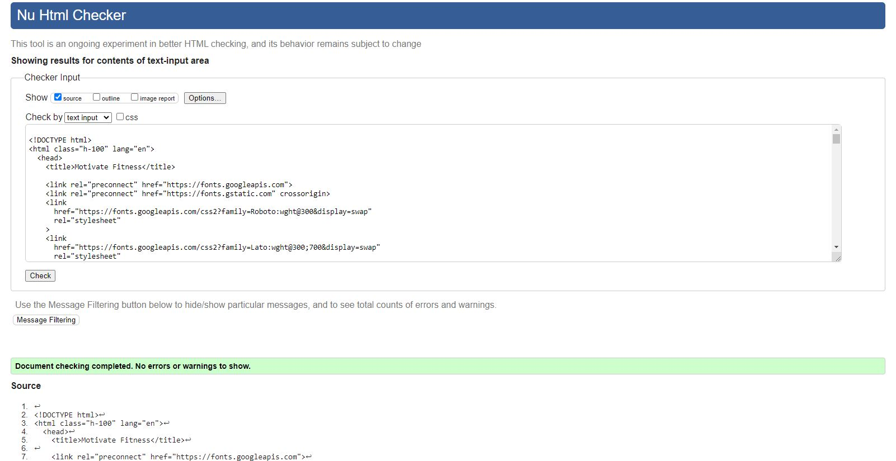

[Back to top](#testing)

**Sign in Page**

* No errors

**Sign up Page**

* No errors

**Sign out Page**

* No errors

**Add booking form page**

* An attribute error for using "placeholder" with date input. The source of this error was in the forms.py date widget. I simply removed the placeholder attribute.
* The end tag error and unlcosed element were related. Both errors were dealt with upon locating the unclosed div and closing it.

    

* The final results after addressing these issues contain no errors:

    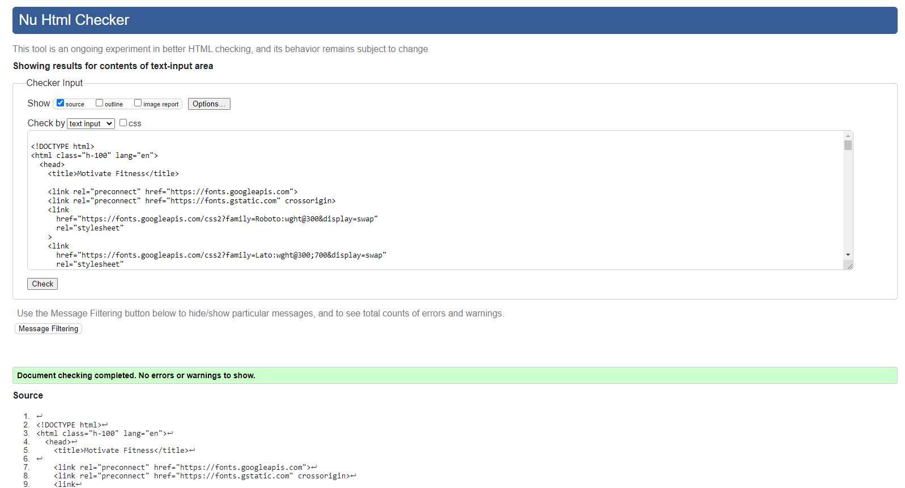

[Back to top](#testing)

**Update booking form page**

* Unsurprisingly the same unclosed div error results occured on this page as the one in the booking form page. Since I create the update form template by copy, pasting and making adjustments to the booking form, this was expected and fixed in the same manner.

    

* Final results after fixes:

    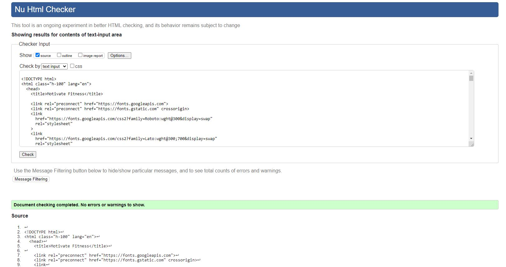

[Back to top](#testing)

**User Profile page**

* No errors

**Cancel appoinment confirmation page**

* An empty attribute value error for the form attribute action="".

    

* Results after removing the unneeded attribute:

    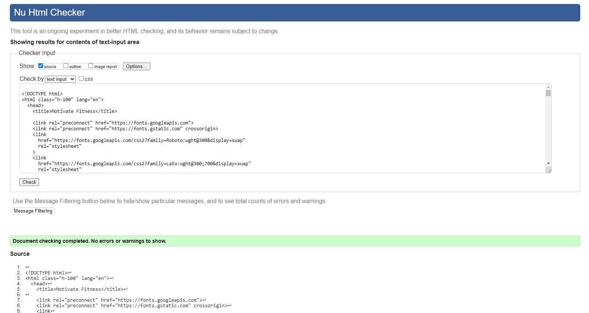

**404 page**

* No errors

[Back to top](#testing)
#

2. ### CSS Validation
CSS Validation was done using [Jigsaw](https://jigsaw.w3.org/css-validator/)

* One error occured for the .btn-secodary class. Too many values. 
* I am not 100% sure, but I think perhaps this error occured becasue I had already targeted the buttons with these rules somewhere else already.

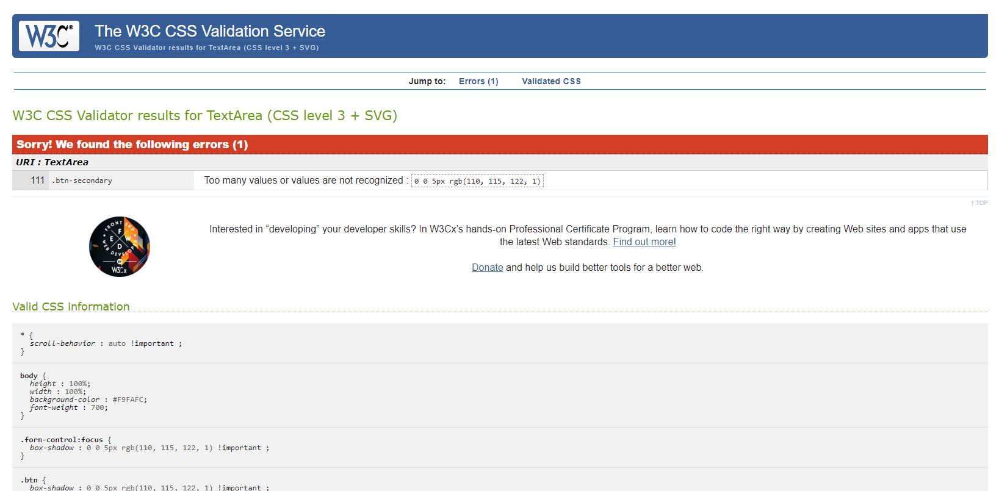

* After playing around with this css for a bit I realised that the particular rule was not really making a differnece to the display and after commenting it out to be sure I decide to delete it.
* After double checking all my styles were working ok, I ran the css through the validator again and it came up clean.

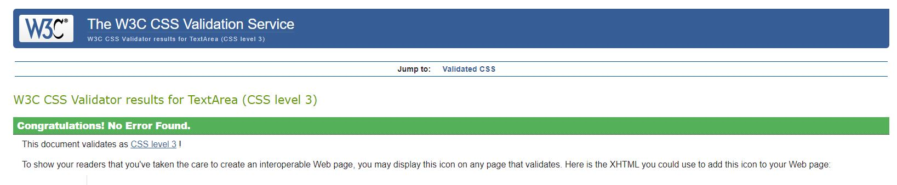

[Back to top](#testing)

#

3. ### Python Validation
 Python Validation was done using the [CI Python Linter](https://pep8ci.herokuapp.com/).
 I used the gitpod problems tab to minimise python code errors as I went along, so there were not that many errors to address from passing the code through the linter. 

#### **Profject files**

**settings.py**
* Initial warnings for this file were as seen in this screenshot:

    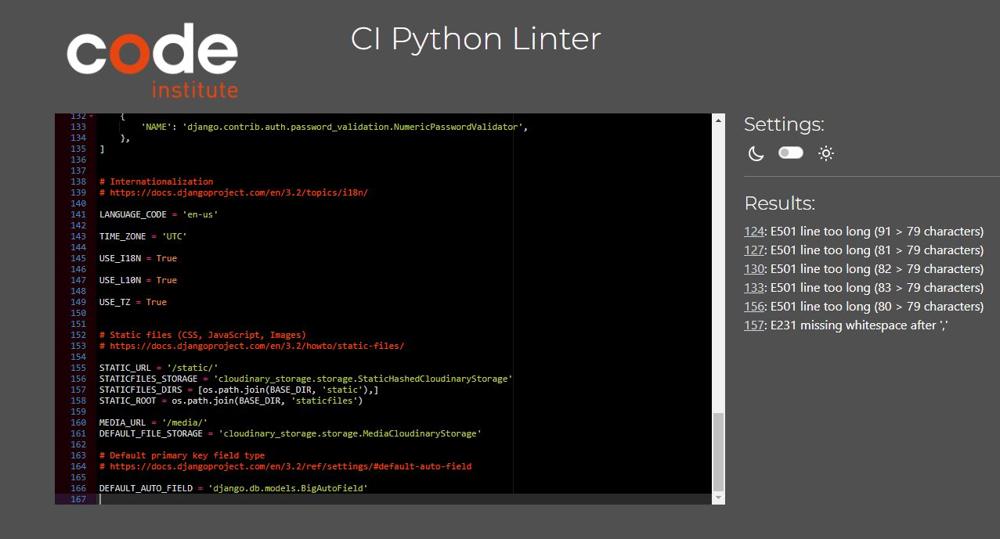

* The settings.py line too long warnings are from the django password validators. 
    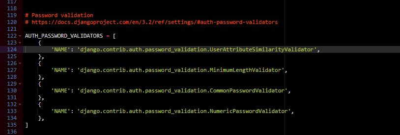

* After consulting my own mentor and other mentors on slack, I left the too long lines in this particular case as they are part of the django automated code and splitting the string up might lead to unforseen issues. 
* The final validation results look like this:

    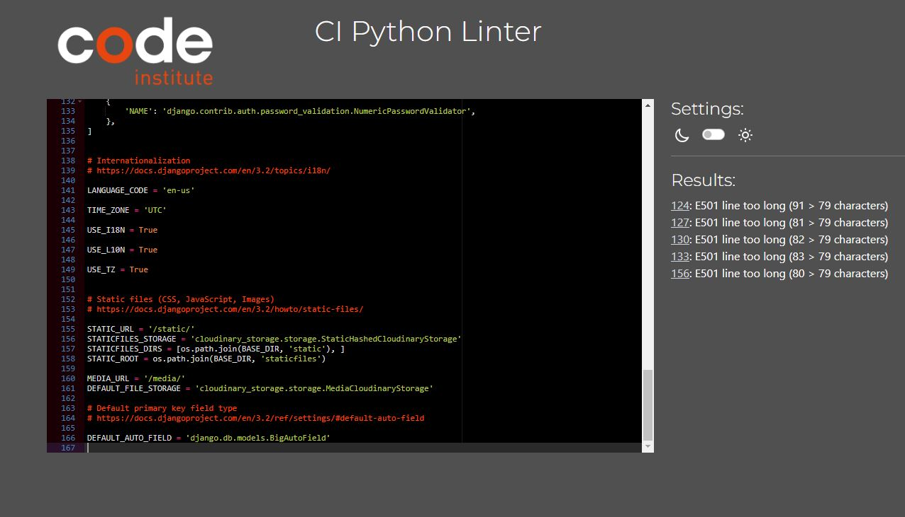

[Back to top](#testing)

**urls.py**
* No errors found

    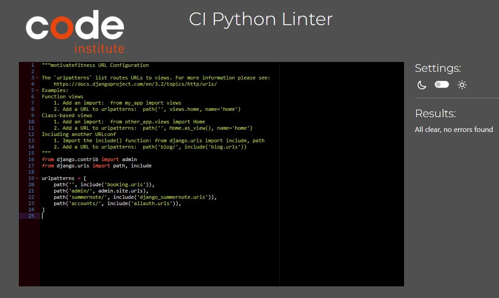

[Back to top](#testing)
#### **Booking app files**

**admin.py**
* No errors found

    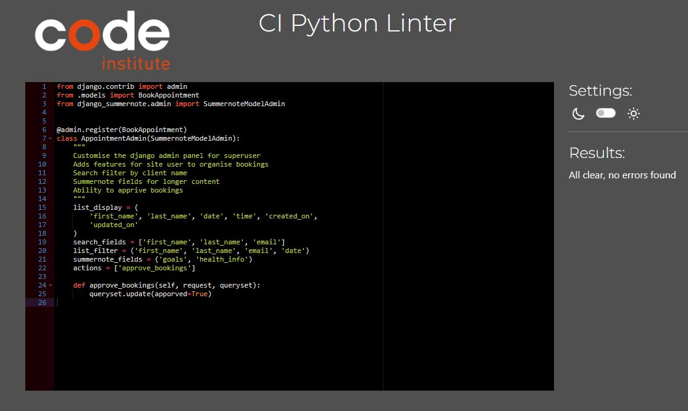

[Back to top](#testing)

**forms.py**
* No errors found

    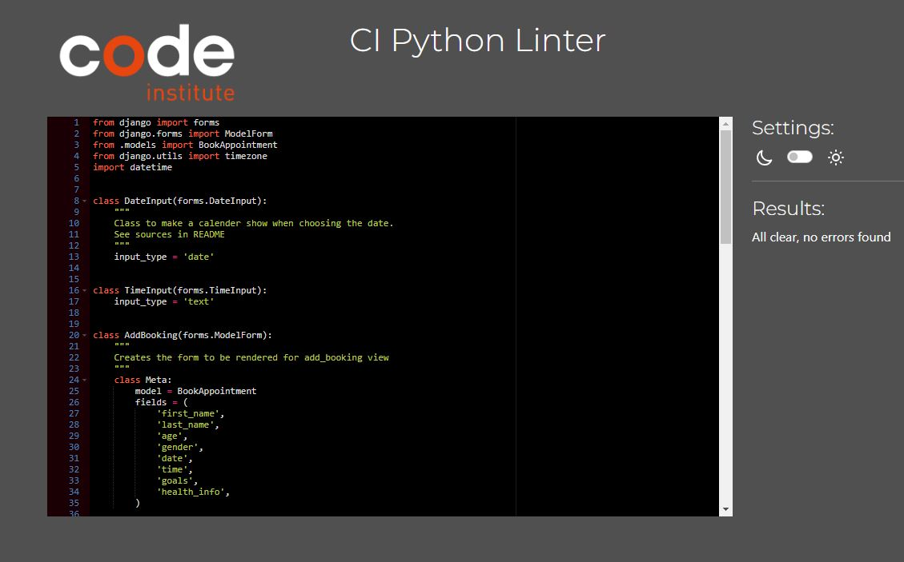

[Back to top](#testing)

**models.py**
* No errors found

    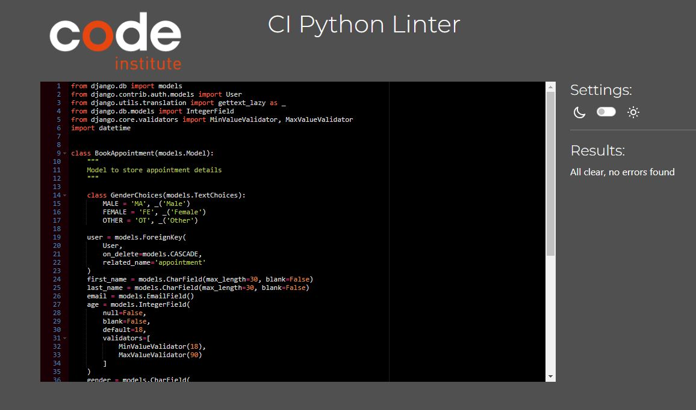

[Back to top](#testing)

**urls.py**
* No errors found

    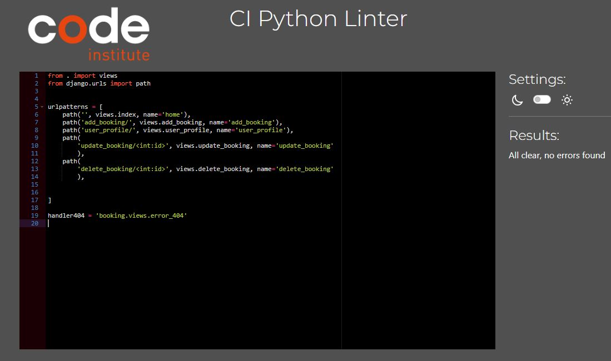

[Back to top](#testing)

**views.py**
* No errors found

    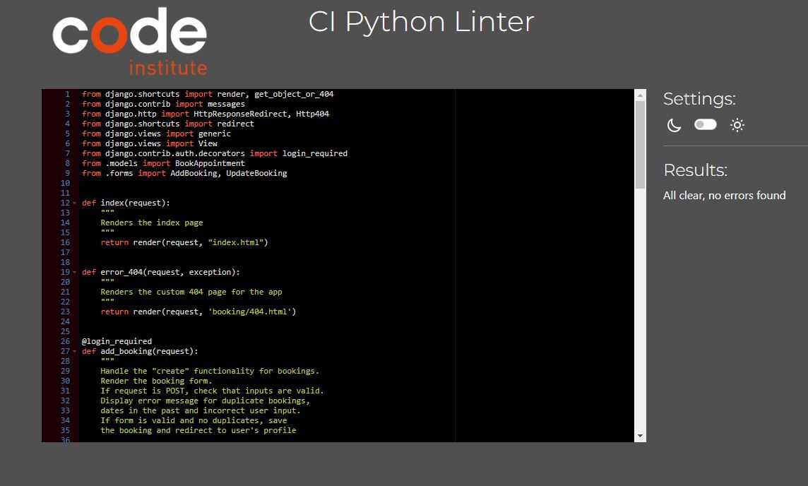

[Back to top](#testing)

- - -
